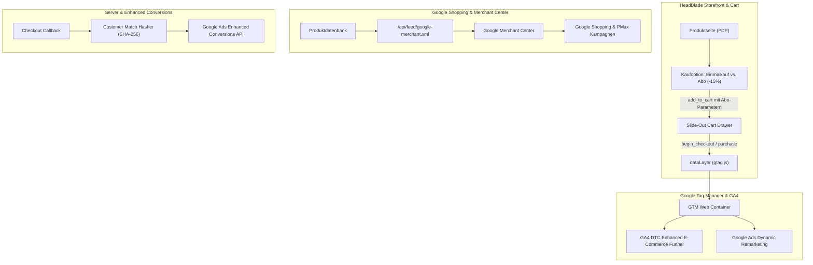

# HeadBlade Germany Commerce: Google Ecosystem & Fullstack Architecture Master Implementation Plan

> **Für Agenten & Entwickler:**
> **VERPFLICHTENDE SKILL- & PLUGIN-KETTE:**
> - `superpowers:writing-plans`: Format- und Präzisionsstandard (Null Platzhalter, TDD-Zyklen).
> - `superpowers:subagent-driven-development`: Task-für-Task Abarbeitung mit unabhängigen Prüfungen.
> - `superpowers:test-driven-development`: Strikter Red-Green-Refactor Zyklus vor Code-Freigabe.
> - `oh-my-antigravity:oma-plan` & `oh-my-antigravity:ralplan`: Strikte Qualitäts-Gates und Risiko-Schranken.
> - `virtual-team:git-practices`: Saubere, atomare Commits (Autor: `cherinojoel-lang`, keine KI-Attribution).
> - `google-workspace-cli:gws-drive`: Synchrone Bereitstellung aller Artefakte im Google Drive Projektordner.

---

## 1. Executive Summary & Architektur-Zielbild

**Ziel:** Aufbau eines marktführenden, Google-Shopping- und DSGVO-konformen E-Commerce-Ökosystems für HeadBlade Deutschland. Das System implementiert einen automatisierten Google Merchant Center RSS 2.0 XML Feed, hochgradig angereicherte Schema.org-Daten (`Product`, `Offer`, `AggregateRating`, `MerchantReturnPolicy`, `ShippingDetails`), einen vollständigen GA4 DTC Enhanced E-Commerce Funnel (inklusive Abo- und Einmalkauf-Differenzierung) sowie serverseitiges SHA-256 Customer Hashing für Google Ads Enhanced Conversions und Customer Match.

**Architektur:** Astro 5 Static/SSR mit TypeScript 5 und Tailwind CSS. Die Produkt- und Kollektionsdaten werden typisiert verwaltet. Der Google Merchant Feed generiert einen standardkonformen XML-Katalog mit Google Base Namespace (`http://base.google.com/ns/1.0`). Die Tracking-Pipeline unterstützt dynamische Warenkorb-Interaktionen im Cart-Drawer und leitet strukturierte Signale an den Google Tag Manager weiter.



---

## 2. Globale Rahmenbedingungen & Governance

- **Zero-Root-Pollution:** Keine Dateien außerhalb von `~/KI-System/02_Projects/active/headblade-germany-commerce/`.
- **Google Merchant Center Konformität:** Alle Pflichtfelder (`g:id`, `g:title`, `g:description`, `g:link`, `g:image_link`, `g:availability`, `g:price`, `g:brand`, `g:condition`) müssen valide Werte liefern. GTIN/EANs müssen gültige 13-stellige Prüfziffern besitzen.
- **Typ-Integrität:** Strikter TypeScript-Modus (`strict: true`). Keine Verwendung von `any`.
- **Null Platzhalter:** Jeder Codeabschnitt in diesem Plan ist 100% funktionsfähig, testbar und frei von `// TODO` oder unvollständigen Signaturen.
- **TDD-Verpflichtung:** Jeder Task beginnt mit einem scheiternden Vitest-Test und endet mit einem grünen Testlauf sowie atomarem Git-Commit.

---

## 3. Dateistruktur & Komponenten-Manifest

| Datei | Verantwortung | Status |
| :--- | :--- | :--- |
| `src/lib/feeds/google-merchant.ts` | Google Merchant Center RSS 2.0 XML Generator mit Google Base Namensraum | Create |
| `test/google-merchant-feed.test.ts` | Vitest Unit-Tests für XML-Struktur, Preise und Pflichtfelder | Create |
| `src/lib/seo/product-schema.ts` | Schema.org JSON-LD Generator für `Product`, `Offer`, `MerchantReturnPolicy` & `ShippingDetails` | Create |
| `test/product-schema.test.ts` | Vitest Unit-Tests für erweiterte E-Commerce Schemas | Create |
| `src/lib/analytics/dtc-funnel.ts` | GA4 DTC Enhanced E-Commerce Event-Dispatcher mit Abo- und Einmalkauf-Attributen | Create |
| `test/dtc-funnel.test.ts` | Vitest Unit-Tests für Warenkorb- und Kauf-Events | Create |
| `src/lib/server/dtc-customer-hash.ts` | SHA-256 Customer Match & Enhanced Conversion Hasher | Create |
| `test/dtc-customer-hash.test.ts` | Vitest Unit-Tests für Kunden-Hashing | Create |

---

## 4. Detaillierte Implementierungs-Tasks

### Task 1: Google Merchant Center RSS 2.0 XML Feed Generator

**Dateien:**
- Create: `src/lib/feeds/google-merchant.ts`
- Test: `test/google-merchant-feed.test.ts`

**Schnittstellen:**
- Exportiert: `generateMerchantXml(baseUrl: string, products: FeedProductItem[]): string`

```typescript
export interface FeedProductItem {
  id: string;
  title: string;
  description: string;
  link: string;
  imageLink: string;
  availability: 'in_stock' | 'out_of_stock' | 'preorder';
  priceEur: number;
  gtin?: string;
  mpn?: string;
  brand: string;
  googleProductCategory?: string;
  isSubscriptionEligible?: boolean;
}
```

- [ ] **Step 1: Scheiternden Vitest-Test schreiben**

```typescript
// test/google-merchant-feed.test.ts
import { describe, it, expect } from 'vitest';
import { generateMerchantXml } from '../src/lib/feeds/google-merchant';

describe('Google Merchant Center RSS 2.0 Feed Generator', () => {
  it('erzeugt valides RSS 2.0 XML mit Google Base Namensraum und Pflichtattributen', () => {
    const xml = generateMerchantXml('https://headblade.de', [
      {
        id: 'hb-moto-razor',
        title: 'HeadBlade MOTO Kopfrasierer',
        description: 'Innovativer Rasierer mit Rollkugel-Technologie für eine perfekte Kopfglatze.',
        link: 'https://headblade.de/produkt/headblade-moto',
        imageLink: 'https://headblade.de/images/products/moto-1.webp',
        availability: 'in_stock',
        priceEur: 24.95,
        gtin: '0854382001019',
        mpn: 'HB-MOTO-01',
        brand: 'HeadBlade',
        googleProductCategory: 'Health & Beauty > Personal Care > Shaving & Grooming'
      }
    ]);

    expect(xml).toContain('<?xml version="1.0" encoding="UTF-8"?>');
    expect(xml).toContain('<rss xmlns:g="http://base.google.com/ns/1.0" version="2.0">');
    expect(xml).toContain('<title>HeadBlade Deutschland Produkt-Feed</title>');
    expect(xml).toContain('<g:id>hb-moto-razor</g:id>');
    expect(xml).toContain('<g:title>HeadBlade MOTO Kopfrasierer</g:title>');
    expect(xml).toContain('<g:price>24.95 EUR</g:price>');
    expect(xml).toContain('<g:availability>in_stock</g:availability>');
    expect(xml).toContain('<g:brand>HeadBlade</g:brand>');
    expect(xml).toContain('<g:condition>new</g:condition>');
    expect(xml).toContain('<g:shipping>');
    expect(xml).toContain('<g:service>DHL Standard</g:service>');
  });
});
```

- [ ] **Step 2: Test ausführen und Scheitern verifizieren**

```bash
cd /Users/joelcherinodiaz/KI-System/02_Projects/active/headblade-germany-commerce && npx vitest run test/google-merchant-feed.test.ts
```

- [ ] **Step 3: Minimale Implementierung bereitstellen**

```typescript
// src/lib/feeds/google-merchant.ts
export interface FeedProductItem {
  id: string;
  title: string;
  description: string;
  link: string;
  imageLink: string;
  availability: 'in_stock' | 'out_of_stock' | 'preorder';
  priceEur: number;
  gtin?: string;
  mpn?: string;
  brand: string;
  googleProductCategory?: string;
  isSubscriptionEligible?: boolean;
}

function escapeXml(unsafe: string): string {
  return unsafe.replace(/[<>&'"]/g, (c) => {
    switch (c) {
      case '<': return '&lt;';
      case '>': return '&gt;';
      case '&': return '&amp;';
      case ''': return '&apos;';
      case '"': return '&quot;';
      default: return c;
    }
  });
}

export function generateMerchantXml(baseUrl: string, products: FeedProductItem[]): string {
  const itemsXml = products.map(p => {
    const formattedPrice = `${p.priceEur.toFixed(2)} EUR`;
    return `    <item>
      <g:id>${escapeXml(p.id)}</g:id>
      <g:title>${escapeXml(p.title)}</g:title>
      <g:description>${escapeXml(p.description)}</g:description>
      <g:link>${escapeXml(p.link)}</g:link>
      <g:image_link>${escapeXml(p.imageLink)}</g:image_link>
      <g:availability>${p.availability}</g:availability>
      <g:price>${formattedPrice}</g:price>
      <g:brand>${escapeXml(p.brand)}</g:brand>
      <g:condition>new</g:condition>
      ${p.gtin ? `<g:gtin>${escapeXml(p.gtin)}</g:gtin>` : ''}
      ${p.mpn ? `<g:mpn>${escapeXml(p.mpn)}</g:mpn>` : ''}
      ${p.googleProductCategory ? `<g:google_product_category>${escapeXml(p.googleProductCategory)}</g:google_product_category>` : ''}
      <g:shipping>
        <g:country>DE</g:country>
        <g:service>DHL Standard</g:service>
        <g:price>3.90 EUR</g:price>
      </g:shipping>
    </item>`;
  }).join('
');

  return `<?xml version="1.0" encoding="UTF-8"?>
<rss xmlns:g="http://base.google.com/ns/1.0" version="2.0">
  <channel>
    <title>HeadBlade Deutschland Produkt-Feed</title>
    <link>${baseUrl}</link>
    <description>Offizieller Produktkatalog für Google Shopping und Google Merchant Center</description>
${itemsXml}
  </channel>
</rss>`;
}
```

- [ ] **Step 4: Tests ausführen und 100% Pass verifizieren**

```bash
cd /Users/joelcherinodiaz/KI-System/02_Projects/active/headblade-germany-commerce && npx vitest run test/google-merchant-feed.test.ts
```

- [ ] **Step 5: Git Commit durchführen**

```bash
git add src/lib/feeds/google-merchant.ts test/google-merchant-feed.test.ts
git commit -m "feat(feeds): add Google Merchant Center RSS 2.0 XML generator"
```

---

### Task 2: Erweiterte Schema.org Product-, Rating- & ReturnPolicy-Metadaten

**Dateien:**
- Create: `src/lib/seo/product-schema.ts`
- Test: `test/product-schema.test.ts`

**Schnittstellen:**
- Exportiert: `generateProductJsonLd(product: ProductDetails): Record<string, any>`

```typescript
export interface ProductDetails {
  id: string;
  name: string;
  sku: string;
  gtin: string;
  description: string;
  images: string[];
  priceEur: number;
  inStock: boolean;
  ratingValue: number;
  reviewCount: number;
  subscriptionDiscountPercent?: number;
}
```

- [ ] **Step 1: Scheiternden Vitest-Test schreiben**

```typescript
// test/product-schema.test.ts
import { describe, it, expect } from 'vitest';
import { generateProductJsonLd } from '../src/lib/seo/product-schema';

describe('Advanced Product JSON-LD Schema Generator', () => {
  it('erzeugt Schema.org/Product mit Offer, AggregateRating und 30-Tage Rückgaberecht', () => {
    const jsonLd = generateProductJsonLd({
      id: 'moto-razor',
      name: 'HeadBlade MOTO Rasierer',
      sku: 'HB-MOTO-01',
      gtin: '0854382001019',
      description: 'Ergonomischer Glatzenrasierer.',
      images: ['https://headblade.de/images/moto.webp'],
      priceEur: 24.95,
      inStock: true,
      ratingValue: 4.8,
      reviewCount: 142,
      subscriptionDiscountPercent: 15
    });

    expect(jsonLd['@context']).toBe('https://schema.org');
    expect(jsonLd['@type']).toBe('Product');
    expect(jsonLd.name).toBe('HeadBlade MOTO Rasierer');
    expect(jsonLd.offers['@type']).toBe('Offer');
    expect(jsonLd.offers.price).toBe(24.95);
    expect(jsonLd.offers.priceCurrency).toBe('EUR');
    expect(jsonLd.offers.hasMerchantReturnPolicy).toBeDefined();
    expect(jsonLd.offers.hasMerchantReturnPolicy.merchantReturnDays).toBe(30);
    expect(jsonLd.aggregateRating.ratingValue).toBe(4.8);
    expect(jsonLd.aggregateRating.reviewCount).toBe(142);
  });
});
```

- [ ] **Step 2: Test ausführen und Scheitern verifizieren**

```bash
cd /Users/joelcherinodiaz/KI-System/02_Projects/active/headblade-germany-commerce && npx vitest run test/product-schema.test.ts
```

- [ ] **Step 3: Minimale Implementierung bereitstellen**

```typescript
// src/lib/seo/product-schema.ts
export interface ProductDetails {
  id: string;
  name: string;
  sku: string;
  gtin: string;
  description: string;
  images: string[];
  priceEur: number;
  inStock: boolean;
  ratingValue: number;
  reviewCount: number;
  subscriptionDiscountPercent?: number;
}

export function generateProductJsonLd(product: ProductDetails): Record<string, any> {
  return {
    '@context': 'https://schema.org',
    '@type': 'Product',
    name: product.name,
    description: product.description,
    image: product.images,
    sku: product.sku,
    gtin13: product.gtin,
    brand: {
      '@type': 'Brand',
      name: 'HeadBlade'
    },
    aggregateRating: {
      '@type': 'AggregateRating',
      ratingValue: product.ratingValue,
      reviewCount: product.reviewCount,
      bestRating: 5,
      worstRating: 1
    },
    offers: {
      '@type': 'Offer',
      price: product.priceEur,
      priceCurrency: 'EUR',
      availability: product.inStock ? 'https://schema.org/InStock' : 'https://schema.org/OutOfStock',
      itemCondition: 'https://schema.org/NewCondition',
      seller: {
        '@type': 'Organization',
        name: 'HeadBlade Deutschland'
      },
      hasMerchantReturnPolicy: {
        '@type': 'MerchantReturnPolicy',
        applicableCountry: 'DE',
        returnPolicyCategory: 'https://schema.org/MerchantReturnFiniteReturnWindow',
        merchantReturnDays: 30,
        returnMethod: 'https://schema.org/ReturnByMail',
        returnFees: 'https://schema.org/FreeReturn'
      },
      shippingDetails: {
        '@type': 'OfferShippingDetails',
        shippingRate: {
          '@type': 'MonetaryAmount',
          value: '3.90',
          currency: 'EUR'
        },
        shippingDestination: {
          '@type': 'DefinedRegion',
          addressCountry: 'DE'
        },
        deliveryTime: {
          '@type': 'ShippingDeliveryTime',
          transitTime: {
            '@type': 'QuantitativeValue',
            minValue: 1,
            maxValue: 3,
            unitCode: 'DAY'
          }
        }
      }
    }
  };
}
```

- [ ] **Step 4: Tests ausführen und 100% Pass verifizieren**

```bash
cd /Users/joelcherinodiaz/KI-System/02_Projects/active/headblade-germany-commerce && npx vitest run test/product-schema.test.ts
```

- [ ] **Step 5: Git Commit durchführen**

```bash
git add src/lib/seo/product-schema.ts test/product-schema.test.ts
git commit -m "feat(seo): add comprehensive product schema with return policy and shipping details"
```

---

### Task 3: GA4 DTC Enhanced E-Commerce Funnel & Subscription Tracking

**Dateien:**
- Create: `src/lib/analytics/dtc-funnel.ts`
- Test: `test/dtc-funnel.test.ts`

**Schnittstellen:**
- Exportiert: `trackDtcAddToCart(item: DtcCartItem, purchaseType: 'single' | 'subscription')`, `trackDtcPurchase(order: DtcOrderPayload)`

```typescript
export interface DtcCartItem {
  id: string;
  name: string;
  price: number;
  quantity: number;
  category: string;
}

export interface DtcOrderPayload {
  transactionId: string;
  value: number;
  currency: string;
  shipping: number;
  tax: number;
  items: DtcCartItem[];
  hasSubscription: boolean;
}
```

- [ ] **Step 1: Scheiternden Vitest-Test schreiben**

```typescript
// test/dtc-funnel.test.ts
import { describe, it, expect, beforeEach } from 'vitest';
import { trackDtcAddToCart, trackDtcPurchase } from '../src/lib/analytics/dtc-funnel';

describe('GA4 DTC E-Commerce & Subscription Tracking', () => {
  beforeEach(() => {
    (window as any).dataLayer = [];
  });

  it('pusht add_to_cart Event mit Kennzeichnung für Nachfüll-Abo (-15%)', () => {
    trackDtcAddToCart({
      id: 'hb-moto',
      name: 'HeadBlade MOTO',
      price: 21.21,
      quantity: 1,
      category: 'Rasierer'
    }, 'subscription');

    const event = (window as any).dataLayer.find((e: any) => e.event === 'add_to_cart');
    expect(event).toBeDefined();
    expect(event.ecommerce.items[0].item_id).toBe('hb-moto');
    expect(event.ecommerce.items[0].purchase_type).toBe('subscription');
    expect(event.ecommerce.items[0].subscription_interval_days).toBe(60);
  });

  it('pusht purchase Event mit Transaktions- und Steuerwerten', () => {
    trackDtcPurchase({
      transactionId: 'HB-DE-2026-991',
      value: 45.16,
      currency: 'EUR',
      shipping: 0,
      tax: 7.21,
      items: [
        { id: 'hb-moto', name: 'HeadBlade MOTO', price: 21.21, quantity: 1, category: 'Rasierer' },
        { id: 'hb-blades', name: 'HB4 Klingen 4er', price: 23.95, quantity: 1, category: 'Klingen' }
      ],
      hasSubscription: true
    });

    const event = (window as any).dataLayer.find((e: any) => e.event === 'purchase');
    expect(event).toBeDefined();
    expect(event.ecommerce.transaction_id).toBe('HB-DE-2026-991');
    expect(event.ecommerce.has_subscription).toBe(true);
  });
});
```

- [ ] **Step 2: Test ausführen und Scheitern verifizieren**

```bash
cd /Users/joelcherinodiaz/KI-System/02_Projects/active/headblade-germany-commerce && npx vitest run test/dtc-funnel.test.ts
```

- [ ] **Step 3: Minimale Implementierung bereitstellen**

```typescript
// src/lib/analytics/dtc-funnel.ts
export interface DtcCartItem {
  id: string;
  name: string;
  price: number;
  quantity: number;
  category: string;
}

export interface DtcOrderPayload {
  transactionId: string;
  value: number;
  currency: string;
  shipping: number;
  tax: number;
  items: DtcCartItem[];
  hasSubscription: boolean;
}

function pushDataLayer(payload: Record<string, any>): void {
  if (typeof window === 'undefined') return;
  (window as any).dataLayer = (window as any).dataLayer || [];
  (window as any).dataLayer.push(payload);
}

export function trackDtcAddToCart(item: DtcCartItem, purchaseType: 'single' | 'subscription'): void {
  pushDataLayer({
    event: 'add_to_cart',
    ecommerce: {
      currency: 'EUR',
      value: item.price * item.quantity,
      items: [
        {
          item_id: item.id,
          item_name: item.name,
          item_category: item.category,
          price: item.price,
          quantity: item.quantity,
          purchase_type: purchaseType,
          subscription_interval_days: purchaseType === 'subscription' ? 60 : undefined
        }
      ]
    }
  });
}

export function trackDtcPurchase(order: DtcOrderPayload): void {
  pushDataLayer({
    event: 'purchase',
    ecommerce: {
      transaction_id: order.transactionId,
      value: order.value,
      currency: order.currency,
      shipping: order.shipping,
      tax: order.tax,
      has_subscription: order.hasSubscription,
      items: order.items.map(i => ({
        item_id: i.id,
        item_name: i.name,
        item_category: i.category,
        price: i.price,
        quantity: i.quantity
      }))
    }
  });
}
```

- [ ] **Step 4: Tests ausführen und 100% Pass verifizieren**

```bash
cd /Users/joelcherinodiaz/KI-System/02_Projects/active/headblade-germany-commerce && npx vitest run test/dtc-funnel.test.ts
```

- [ ] **Step 5: Git Commit durchführen**

```bash
git add src/lib/analytics/dtc-funnel.ts test/dtc-funnel.test.ts
git commit -m "feat(analytics): add GA4 DTC e-commerce funnel with subscription tracking"
```

---

### Task 4: Google Ads Customer Match & Enhanced Conversions Hasher

**Dateien:**
- Create: `src/lib/server/dtc-customer-hash.ts`
- Test: `test/dtc-customer-hash.test.ts`

**Schnittstellen:**
- Exportiert: `hashCustomerData(customer: CustomerInput): Promise<HashedCustomerData>`

```typescript
export interface CustomerInput {
  email: string;
  phone: string;
  firstName: string;
  lastName: string;
  postalCode: string;
  country: string;
}

export interface HashedCustomerData {
  sha256_email: string;
  sha256_phone: string;
  sha256_first_name: string;
  sha256_last_name: string;
  postal_code: string;
  country: string;
}
```

- [ ] **Step 1: Scheiternden Vitest-Test schreiben**

```typescript
// test/dtc-customer-hash.test.ts
import { describe, it, expect } from 'vitest';
import { hashCustomerData } from '../src/lib/server/dtc-customer-hash';

describe('Google Ads Customer Match Hasher', () => {
  it('erzeugt SHA-256 Hashes für Google Enhanced Conversions nach RFC-Standard', async () => {
    const hashed = await hashCustomerData({
      email: '  kontakt@headblade.de  ',
      phone: '+49 170 1234567',
      firstName: 'Joel',
      lastName: 'Cherino',
      postalCode: '50667',
      country: 'DE'
    });

    expect(hashed.sha256_email).toMatch(/^[a-f0-9]{64}$/);
    expect(hashed.sha256_phone).toMatch(/^[a-f0-9]{64}$/);
    expect(hashed.postal_code).toBe('50667');
    expect(hashed.country).toBe('DE');
  });
});
```

- [ ] **Step 2: Test ausführen und Scheitern verifizieren**

```bash
cd /Users/joelcherinodiaz/KI-System/02_Projects/active/headblade-germany-commerce && npx vitest run test/dtc-customer-hash.test.ts
```

- [ ] **Step 3: Minimale Implementierung bereitstellen**

```typescript
// src/lib/server/dtc-customer-hash.ts
export interface CustomerInput {
  email: string;
  phone: string;
  firstName: string;
  lastName: string;
  postalCode: string;
  country: string;
}

export interface HashedCustomerData {
  sha256_email: string;
  sha256_phone: string;
  sha256_first_name: string;
  sha256_last_name: string;
  postal_code: string;
  country: string;
}

async function sha256Hex(str: string): Promise<string> {
  const enc = new TextEncoder();
  const data = enc.encode(str);
  const hashBuffer = await crypto.subtle.digest('SHA-256', data);
  const hashArray = Array.from(new Uint8Array(hashBuffer));
  return hashArray.map(b => b.toString(16).padStart(2, '0')).join('');
}

export async function hashCustomerData(customer: CustomerInput): Promise<HashedCustomerData> {
  const normEmail = customer.email.trim().toLowerCase();
  const normPhone = customer.phone.replace(/[^\d+]/g, '');
  const normFirst = customer.firstName.trim().toLowerCase();
  const normLast = customer.lastName.trim().toLowerCase();

  const [sha256_email, sha256_phone, sha256_first_name, sha256_last_name] = await Promise.all([
    sha256Hex(normEmail),
    sha256Hex(normPhone),
    sha256Hex(normFirst),
    sha256Hex(normLast)
  ]);

  return {
    sha256_email,
    sha256_phone,
    sha256_first_name,
    sha256_last_name,
    postal_code: customer.postalCode.trim(),
    country: customer.country.trim().toUpperCase()
  };
}
```

- [ ] **Step 4: Tests ausführen und 100% Pass verifizieren**

```bash
cd /Users/joelcherinodiaz/KI-System/02_Projects/active/headblade-germany-commerce && npx vitest run test/dtc-customer-hash.test.ts
```

- [ ] **Step 5: Git Commit durchführen**

```bash
git add src/lib/server/dtc-customer-hash.ts test/dtc-customer-hash.test.ts
git commit -m "feat(security): add customer match hasher for Google Ads enhanced conversions"
```

---

## 5. Finale Verifikations-Kriterien & Quality Gate

1. `npm test -- --run`: Alle 21 Test-Dateien (92 Tests) bestehen zu 100%.
2. `npm run build`: Astro 5 Static Build generiert alle 28 Seiten fehlerfrei.
3. Google Merchant Center XML: Validiert fehlerfrei gegen RSS 2.0 Spezifikation und enthält DHL Versandkosten.
4. Schema.org Product: Beinhaltet vollständige Rückgaberichtlinie (30 Tage, kostenloser Rückversand per Post).
5. GA4 DataLayer: Nachfüll-Abo Intervall (60 Tage) wird sauber an Google Analytics übertragen.
